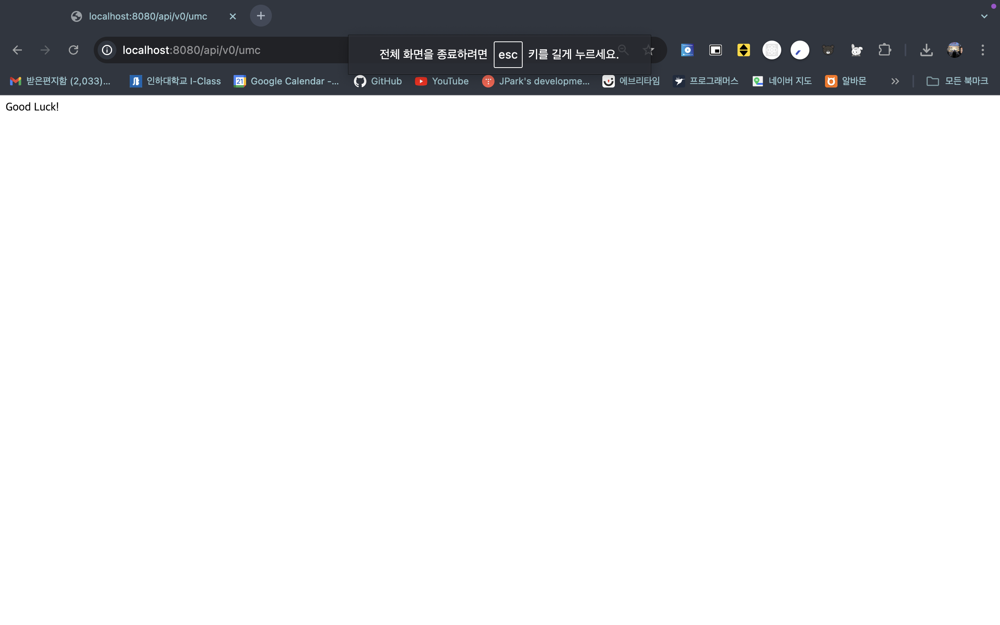

### 1. 너디너리 홈페이지 접속하는 과정 적어보기 (소켓프로그래밍과 같은 개념 없이 TCP, IP, PORT 등의 개념 등 오늘 배운 내용으로 간단하게 적어주세요)

1. 사용자가 브라우저에 url 입력
2. DNS 조회 (53번 포트 활용)

   1. 브라우저 캐시 조회
   2. 운영체제 캐시 조회
   3. 로컬 DNS 서버에 질의 ( ISP에서 제공하는 DNS 서버 )
   4. DNS 서버 확인 → 자세한 과정 생략

   → DNS 조회를 통해 웹페이지를 제공해주는 서버 IP 획득 (Web Server, WAS, Load Balancer, Reverse Proxy Server etc..)

3. DNS를 통해 얻은 IP로 TCP/IP 연결 설정
   1. TCP 3-way handshake 활용해 세션 설정하기
4. 연결 완료 후 HTTP요청 보내기
   1. 정적 콘텐츠 요청 → Web Server에서 정적 콘텐츠 반환
   2. 동적 콘텐츠 요청 → WAS에서 로직 처리 후 반환
   3. HTTPS 요청이 필요한 경우 → HTTPS로 301 리다이렉트 요청 반환
5. (Optional) HTTPS로 301 리다이렉트 요청을 받을 경우
   1. SSL/TLS 핸드셰이크로 세션 설정 (TCP 3-way handshake 이후)
   2. HTTPS로 재요청, D의 1,2와 동일
6. 브라우저 렌더링

### 2. 깃허브 clone 받아서 실행하고 나온 페이지 스크린 샷 찍기

