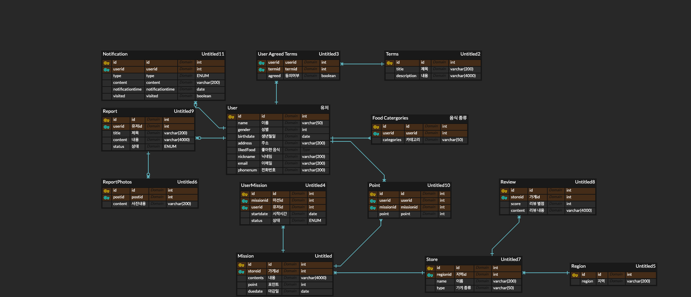

## ERD Preview

# API 설계

## 알림 존재 여부

| 항목               | 내용                                |
| ------------------ | ----------------------------------- |
| **API Endpoint**   | `GET` /notification/info            |
| **Request Body**   | 필요 없음                           |
| **Request Header** | Authorization: accessToken (String) |
| **Query String**   | 필요 없음                           |

## 달성 미션 개수

| 항목               | 내용                                |
| ------------------ | ----------------------------------- |
| **API Endpoint**   | `GET` /missions/count               |
| **Request Body**   | 필요 없음                           |
| **Request Header** | Authorization: accessToken (String) |
| **Query String**   | 필요 없음                           |

## 추천 미션 리스트

| 항목               | 내용                                |
| ------------------ | ----------------------------------- |
| **API Endpoint**   | `GET` /missions/{regionid}          |
| **Request Body**   | 필요 없음                           |
| **Request Header** | Authorization: accessToken (String) |
| **Query String**   | 필요 없음                           |

## 리뷰 작성

| 항목               | 내용                                                                                                                                                                                       |
| ------------------ | ------------------------------------------------------------------------------------------------------------------------------------------------------------------------------------------ |
| **API Endpoint**   | `POST` /review                                                                                                                                                                             |
| **Request Body**   | `{` &emsp;`"store_id": ${store_id},` &emsp;`"mission_id": ${mission_id},` &emsp;`"score": ${review_score},` &emsp;`"content": "내용",` &emsp;`"image": ["imageUrl"]` `}` |
| **Request Header** | `Authorization`: accessToken (String) `Content-Type`: application/json                                                                                                                  |
| **Query String**   | 필요 없음                                                                                                                                                                                  |

## 나의 미션 목록 조회

| 항목               | 내용                                                         |
| ------------------ | ------------------------------------------------------------ |
| **API Endpoint**   | `GET`/mission                                                |
| **Request Body**   | 필요 없음                                                    |
| **Request Header** | Authorization: accessToken (String)                          |
| **Query String**   | `status` (String)                                            |
| **Query 설명**     | `status`는 미션 상태를 나타내며, 다음 값을 가질 수 있습니다: |
|                    | - `in_progress`: 진행 중인 미션 조회                         |
|                    | - `completed`: 완료된 미션 조회                              |

## 미션 성공 요청

| 항목               | 내용                                                                      |
| ------------------ | ------------------------------------------------------------------------- |
| **API Endpoint**   | `PATCH` /mission                                                          |
| **Request Body**   | { "missionStatus": ${STATUS_TYPE} }                                       |
| **Request Header** | `Authorization`: accessToken (String) `Content-Type`: application/json |
| **Query String**   | 필요 없음                                                                 |

| 항목               | 내용                                                                                                                                                                                                                                                             |
| ------------------ | ---------------------------------------------------------------------------------------------------------------------------------------------------------------------------------------------------------------------------------------------------------------- |
| **API Endpoint**   | `POST` /users/signup                                                                                                                                                                                                                                             |
| **Request Body**   | `{` `"id": 1,` `"name": "홍길동",` `"gender": 1,` `"birthdate": "1995-06-15",` `"address": "서울특별시 강남구",` `"likedFood": "김치찌개",` `"nickname": "길동이",` `"email": "hong@gmail.com",` `"phonenum": "010-1234-5678"` `}` |
| **Request Header** | `Content-Type`: application/json                                                                                                                                                                                                                                 |
| **Query String**   | 필요 없음                                                                                                                                                                                                                                                        |
